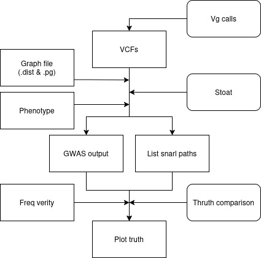
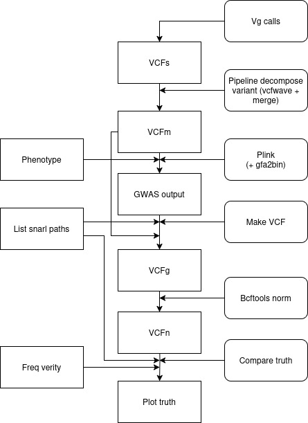
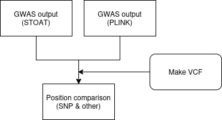

# Report GWAS analysis results comparison stoat vs plink vs gfa2bin

## Introduction
To test the different tools, we perform two types of simulations: binary and quantitative. And one gwas analysis from a drosophilia dataset [article](https://doi.org/10.1038/nature10811).

The **binary simulation** consists of 100 samples, each containing 1,000 variations. Each sample is simulated to belong to one of two groups. The probability of transitioning from one node to another in the graph is known for each group.  

The **quantitative simulation** consists of 200 samples with 1,000 variations. Each sample is simulated with a normalized quantitative phenotype centered at 0. Similar to the binary simulation, samples belong to one of two groups, but here, this dependence is modulated by the phenotype value of each sample. The probability of transitioning from one node to another in the graph is known for each group.  

The **Drosophila dataset** consists of 143 samples from NCBI's SRA, each representing a unique inbred line (remaining sample after the filtration). The **genome** of *Drosophila melanogaster* contains four chromosome pairs and approximately 14,000 genes, excluding chromosome 4, which lacks known genes. The **phenotype data** includes starvation resistance, measured as the mean survival time under starvation conditions.

**Available files:**  
- VCFs (output from the calling pipeline)  
- Node transition probabilities (.freq)(simulations)
- Information on the pangenomic graph (.dist, .pg, .gfa)  
- Phenotypes

## Methods  
First, we aim to test the different tools without any prior data preprocessing. To do this, we merge the VCFs (output of vg calls) using the `bcftools merge` command and then run the various tools (Stoat/Plink) on the merged VCF.

```bash
bcftools merge $dir_vcf/*.vcf.gz --threads 6 -m none -Oz -o $output/merged_vcf.vcf
```

Then, we decided to decompose variants on the VCFs using a Snakemake pipeline to remove nested snarls, which would not be properly analyzed by Plink. In this step, the VCFs will be normalized and then merged (using vcfbub and vcfwave tools).

### Pipeline for stoat analysis (and stoat version gfa2bin)


### Pipeline for plink analysis (and gfa2bin)


### Verify thruth Stoat

To compare the ground truth with Stoat, we analyze the nodes traversed by paths within a given snarl. A snarl is considered significant if it contains at least two paths where the node traversal frequency differs between groups (phenotypes) in the frequency file (.freq).

**Exemple:**

freq file
```
start_node	next_node	group	freq
2	3	0	0.53
2	3	1	0.53
2	4	0	0.47
2	4	1	0.47
```

snarl paths stoat
```
chr	pos	snarl	paths	        type
ref	590	2_5	    >2>3>5,>2>4>5	C,G
```

GWAS output stoat
```
CHR	POS	SNARL	TYPE	P_FISHER	P_CHI2	ALLELE_NUM
ref	590	2_5	    C,G	    0.8165	    0.8935	75
```

Here the snarl 2_5 containt the paths 2>3 and 2>4 but the frequency between each groups aren't different, so the snarl are not significatif.

### Verify thruth Plink
To compare the ground truth with Plink, we analyze the positions for a given snarl/line. A snarl/line on the gwas output is considered significant if it's position match 2 paths where the node traversal frequency differs between groups (phenotypes) in the modified frequency file (.freq).

freq file
```
start_node	next_node	group	freq
1	2	0	0.2
1	2	1	0.2
1	9	0	0.8
1	9	1	0.8
2	3	0	0.53
2	3	1	0.53
2	4	0	0.47
2	4	1	0.47
```

snarl paths stoat
```
chr	pos	snarl	paths	        type
ref	411	1_9	    >1>9,>1>2>*>8>9	C_G,CPX
ref	590	2_5	    >2>3>5,>2>4>5	C,G
```

GWAS output plink
```
CHR	SNP	    BP	A1	F_A	    F_U	    A2	CHISQ	P	    OR
ref	>1>9	411	C	0.06329	0.0974	C	1.231	0.2672	0.6261
ref	>1>9	590	G	0	    0.5	    C	1.714	0.1904	0
```

The GWAS PLINK line `ref >1>9 411` will match the paths `>1>9, >1>2>*>8>9` in the snarl paths file. The frequency nodes `1>9` and `1>2` will be analyzed here.

### Verify thruth gfa2bin & stoat(2bin)
To compare the ground truth with gfa2bin, we analyze the node id for a given line. A line on the gwas output is considered significant if it's node id where find differs between groups (phenotypes) in the frequency file (.freq).

GWAS output plink+gfa2bin
```
CHR	SNP	BP	A1	F_A	    F_U	    A2	CHISQ	P	    OR
ref	1	1	A	0	    0	    T	NA	    NA	    NA
ref	2	2	T	0.16	0.215	A	3.971	0.04628	0.6955
```

GWAS output stoat(2bin)
```
CHR	POS	NODE	P_FISHER	P_CHI2
ref	590	3	    0.6186	    0.6180
ref	590	4	    0.3125	    0.3125
```

Here in **gfa2bin**, the position (BP) wasn't properly defined (either due to a missing argument or unsupported functionality—I’m not sure yet). Additionally, all nodes are provided, including edges, without any significance between groups (ref **1**). **Stoat (2bin)** only analyzes nodes contained within a 'simple' snarl (where the path length **= 3**).

remembering
```
chr	pos	snarl	paths	        type
ref	411	1_9	    >1>9,>1>2>*>8>9	C_G,CPX
ref	590	2_5	    >2>3>5,>2>4>5	C,G
```

In snarl >1>9, only node 3 and 4 are tested because only them aren't edges.
see [vg find graph](pictures/subgraph.svg) for more details (binary simulation).

```
vg find -x simulation/binary_data/pg.pg -r 1:100 -c 10 | vg view -dp - | dot -Tsvg -o subgraph.svg
```

### Comparison Plink & Stoat (without thruth)


## Result

https://docs.google.com/document/d/1n2c4PQu9ZmwSC2EgaurxFVJx29CekObpZ54GYlqvc2o/edit?tab=t.0#heading=h.pu0fktu4kf7n
